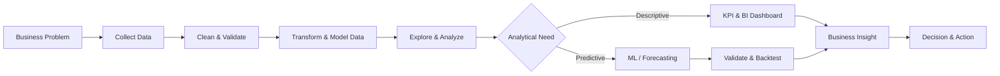

<div align="center">

# Siddhika Lolage

### Data Analytics • Business Intelligence • Machine Learning • Data Science

<p>
  <a href="https://github.com/siddhikalolage"></a>
  <a href="https://www.linkedin.com/in/siddhika-lolage/"></a>
  <a href="mailto:siddhikalolage@gmail.com"></a>
</p>

<b>I build data-driven systems that turn raw data into insights, predictive intelligence, and practical decisions.</b>

<br><br>

<a href="#featured-projects">🚀 Projects</a> •
<a href="#what-i-build">🧭 What I Build</a> •
<a href="#technology-stack">🛠️ Tech Stack</a> •
<a href="#engineering-approach">🔄 Approach</a> •
<a href="#current-focus">🔭 Current Focus</a> •
<a href="#lets-connect">🤝 Connect</a>

</div>

---

## 👋 About Me

I am an **Information Technology graduate** focused on building practical, end-to-end solutions across **Data Analytics, Business Intelligence, Machine Learning, and Data Science**.

I approach projects as real problem-solving systems rather than isolated notebooks or dashboards — connecting **business problems → data → transformation → analysis → modeling → validation → visualization → decision**.

- 📊 Building analytics and BI solutions with **Python, SQL and Power BI**
- 📈 Working with **forecasting, KPI analysis and decision intelligence**
- 🤖 Building ML systems with **Scikit-learn and TensorFlow**
- 🏗️ Working with modern analytical workflows using **Snowflake and dbt**
- 🧠 Interested in production-oriented ML, explainable analysis and real-world applications
- 🎯 Open to roles in **Data Analytics • Business Intelligence • Data Science • Machine Learning**

---

## 🧭 What I Build

| Area | Focus |
|---|---|
| 📊 **Data Analytics** | KPI analysis, exploratory analysis, business insights, data quality |
| 📈 **Forecasting** | Demand forecasting, time-series analysis, backtesting, decision support |
| 📉 **Business Intelligence** | Executive dashboards, KPI storytelling, interactive Power BI reporting |
| 🤖 **Machine Learning** | Classification, feature engineering, predictive pipelines, validation |
| 🧠 **Deep Learning** | CNNs, transfer learning, computer vision, model experimentation |
| 🏗️ **Data Engineering** | SQL transformations, Snowflake, dbt, analytical data layers |

---

## 🚀 Featured Projects

<div align="center">

| 🥇 Flagship Analytics | 🤖 Flagship ML |
|---|---|
| **[Retail Demand Forecasting](https://github.com/siddhikalolage/retail-demand-forecasting-project)**<br>Snowflake • dbt • Forecasting • Power BI | **[Sign Language → Speech](https://github.com/siddhikalolage/sign-language-to-speech-converter)**<br>MediaPipe • Scikit-learn • ExtraTrees • CV |
| **[Financial Market Analytics](https://github.com/siddhikalolage/Financial-Market-Analytics-And-Decision-Intelligence-Dashboard)**<br>Python • SQL • Power BI • Decision Intelligence | **[Plant Disease Classification](https://github.com/siddhikalolage/plant-disease-classification)**<br>TensorFlow • Keras • CNN • Transfer Learning |

</div>

<a id="featured-projects"></a>

### 🥇 Retail Demand Forecasting & Decision Intelligence

**End-to-end Data Analytics + BI platform**

`Snowflake` `dbt` `Forecasting` `Power BI` `SQL` `Python`

- Retail demand forecasting and business decision support
- Layered analytical architecture from raw data to marts
- dbt transformations, testing and data-quality workflow
- Forecast intelligence integrated with executive Power BI reporting
- Designed around practical questions such as **what is selling, where demand is changing, and what action should follow**

**Portfolio signal:** data engineering + analytics + forecasting + executive BI in one system.

---

### 🥈 Financial Market Analytics & Decision Intelligence Dashboard

**Business-focused Data Analytics + BI project**

`Python` `SQL` `Power BI` `Financial Analytics` `Decision Intelligence`

- Interactive financial-market analysis and KPI monitoring
- Performance, trend and risk-oriented insights
- Data-quality and analytical validation workflow
- Executive-style dashboard storytelling
- Converts market data into interpretable business decisions rather than isolated charts

**Portfolio signal:** strong fit for Data Analyst / BI Analyst responsibilities.

---

### 🥉 Sign Language → Speech Converter

**Real-time applied Machine Learning / Computer Vision system**

`Python` `MediaPipe` `Scikit-learn` `ExtraTrees` `Computer Vision` `gTTS`

- Real-time webcam gesture recognition
- MediaPipe landmark extraction with engineered geometric features
- **144 raw landmark values → 328 engineered features → 43 gesture classes**
- Scikit-learn pipeline with deterministic model configuration
- Landmark-first inference with YOLO fallback strategy
- Phrase construction and speech output
- Artifact validation and reproducibility checks

**Portfolio signal:** feature engineering + ML pipelines + inference architecture + validation.

---

### 4️⃣ Plant Disease Classification

**Deep Learning / Computer Vision experimentation project**

`Python` `TensorFlow` `Keras` `CNN` `Transfer Learning` `Scikit-learn`

- Multi-class plant disease image classification
- CNN baseline and transfer-learning experiments
- EfficientNet and MobileNet model exploration
- Augmentation, checkpointing, early stopping and learning-rate scheduling
- Evaluation-oriented model development

**Portfolio signal:** practical deep-learning experimentation and model-development workflow.

<details>
<summary><b>🔎 Explore More Projects</b></summary>

| Project | Area | Focus |
|---|---|---|
| [Startup AI Agent](https://github.com/siddhikalolage/Startup_Ai_agent) | GenAI | AI-agent / watsonx experimentation |
| [Phishing Website Detection](https://github.com/siddhikalolage/phishing-website-detection) | ML + Security | Classification and cybersecurity |
| [Sales Forecasting](https://github.com/siddhikalolage/sales-forecasting) | Analytics / ML | Forecasting and predictive analysis |
| [Automated System Health Monitoring Dashboard](https://github.com/siddhikalolage/Automated-System-Health-Monitoring-Dashboard) | Monitoring | System metrics and dashboarding |
| [Daily Programming Challenge](https://github.com/siddhikalolage/Daily-Programming-Challenge) | Programming | Problem solving and coding practice |

</details>

---

<a id="engineering-approach"></a>
## 🔄 Engineering Approach



### My project philosophy

**Don't stop at the model. Don't stop at the dashboard.**

I aim to connect technical output to a decision:

> **Data → Evidence → Insight → Decision → Action**

---

<a id="technology-stack"></a>
## 🛠️ Technology Stack

### Analytics & Programming

<p>
  
  
  
</p>

### Data & BI

<p>
  
  
  
</p>

### Machine Learning & AI

<p>
  
  
  
  
</p>

### Engineering & Tools

<p>
  
  
  
  
  
</p>

---

## 🧪 Engineering Principles

I try to make projects **reproducible, testable and explainable**, not just visually impressive.

- ✅ Separate raw data, transformations, models and presentation layers
- ✅ Validate data and model artifacts before relying on them
- ✅ Prefer deterministic configurations where practical
- ✅ Document assumptions and analytical decisions
- ✅ Use testing and validation to catch silent failures
- ✅ Build dashboards around questions and decisions, not decoration
- ✅ Keep outputs understandable to both technical and business audiences

---

## 📚 Certifications

- **Microsoft Azure Fundamentals — AZ-900**

---

<a id="current-focus"></a>
## 🔭 Current Focus

```text
Data Analytics
      ↓
Business Intelligence
      ↓
Forecasting & Decision Intelligence
      ↓
Machine Learning
      ↓
Production-oriented Data / ML Systems
```

**Career focus:** building reliable, explainable and business-oriented data products while pursuing opportunities in **Data Analytics, Business Intelligence, Data Science and Machine Learning**.

---

## 📈 GitHub Activity

<div align="center">


</div>

---

<a id="lets-connect"></a>
## 🤝 Let's Connect

I am interested in opportunities and collaborations around **Data Analytics, Business Intelligence, Data Science and Machine Learning**.

<div align="center">

**[GitHub](https://github.com/siddhikalolage) • [LinkedIn](https://www.linkedin.com/in/siddhika-lolage/) • [Email](mailto:siddhikalolage@gmail.com)**

<br><br>

*Turning data into insight. Turning insight into decisions.*

</div>
